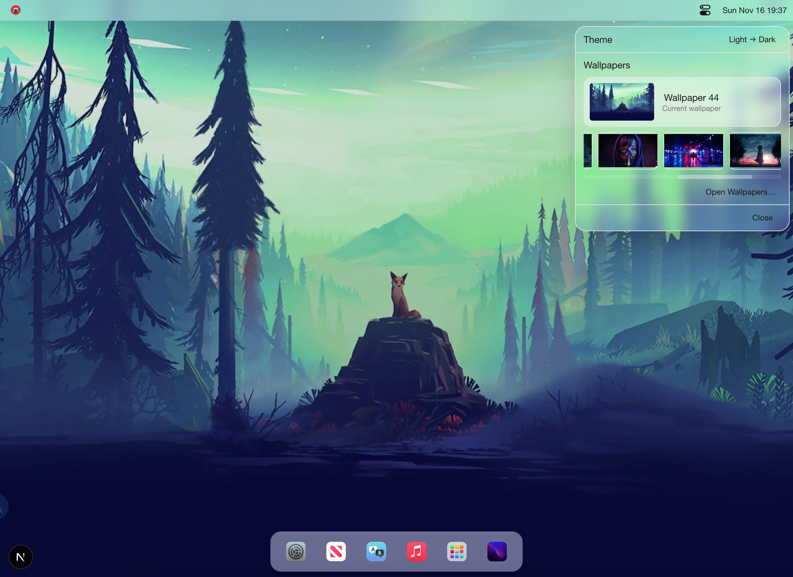
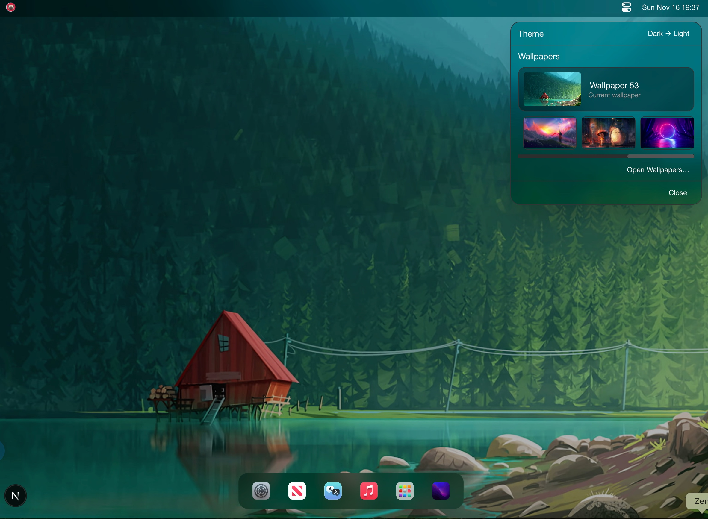

# 🐕 Doggy Nav - 中文文档

<div align="center">

[](https://opensource.org/licenses/MIT)
[](https://nodejs.org/)
[](http://makeapullrequest.com)


[](https://github.com/MARVElOUS-DEV/doggy-nav/actions)

_现代化的自托管导航与书签管理系统_

[English](./README.md) | [简体中文](./README-zh-CN.md)

[🚀 功能特性](#-功能特性) • [📦 快速开始](#-快速开始) • [🔧 开发](#-开发环境搭建) • [🐳 Docker](#-docker-部署) • [📖 文档](#-文档)

</div>

---

## 📝 概览

Doggy Nav 是一款为团队和个人设计的导航与书签管理系统。基于现代 Web 技术构建，提供简洁直观的界面，用于在不同环境中组织和分享书签。

### 🎯 适用场景

- **团队书签管理** - 为研发/运维团队提供共享导航页
- **个人导航主页** - 自用导航站与书签整理, 一站式个人快捷访问桌面
- **云端 SaaS 服务** - 支持多租户场景的书签服务
- **企业内部门户** - 公司内部系统/文档统一导航

## 📸 截图预览

<p align="center">
  
  
  <br/>
  
  
  <br/>
  
  
  <br/>
  
  
  <br/>
  
  
</p>

## ✨ 功能特性

### 🌟 核心功能

- **📚 智能组织** - 分类、标签与搜索能力
- **👥 多用户支持** - 用户认证与权限控制
- **⭐ 收藏系统** - 快速访问常用书签
- **📊 数据统计面板** - 访问次数与热度统计
- **🔍 高级搜索** - 支持全文检索与多条件过滤
- **📱 自适应布局** - 适配桌面端、平板和移动端

### 🛠 技术特性

- **🚀 高性能** - 基于 Next.js 等现代框架构建
- **🔒 安全优先** - JWT 鉴权、输入校验等安全措施
- **🐳 Docker 友好** - 一键容器化部署
- **📈 可扩展架构** - 支持传统后端与边缘计算后端
- **🔄 实时更新** - 数据实时同步
- **🌐 国际化** - 内置中英文多语言支持

## 🏗 架构概览

Doggy Nav 支持两套后端栈，并支持多种部署方式（Docker、传统 Node 托管、Cloudflare Pages/Workers）：

```
┌─────────────────────────────── 前端与管理端 ───────────────────────────────┐
│                                                                           │
│  doggy-nav-main (Next.js)           doggy-nav-admin (Umi SPA)             │
│  - Docker: http://localhost:3001    - Docker: http://localhost:8080       │
│  - Vercel / Node 托管               - Cloudflare Pages + Pages Functions  │
└───────────────────────────────┬───────────────────────────────────────────┘
                                │
                  ┌─────────────┴───────────────────┐
                  │                                 │
          经典后端栈                           边缘后端栈
        (Docker / Node)                      (Cloudflare Workers)

   ┌─────────────────────────┐        ┌─────────────────────────┐
   │ doggy-nav-server        │        │ doggy-nav-workers       │
   │ Egg.js REST API         │        │ Hono on Cloudflare      │
   │ 端口: 3002 (Docker)     │        │ Workers / D1 database   │
   └─────────────┬───────────┘        └─────────────┬───────────┘
                 │                                  │
        ┌────────▼────────┐                 ┌───────▼──────────┐
        │   MongoDB       │                 │  Cloudflare D1   │
        │   端口: 27017   │                 │  (SQL at edge)   │
        └─────────────────┘                 └───────────────────┘
```

### 📁 项目结构

```
doggy-nav/
├── packages/
│   ├── doggy-nav-main/      # Next.js 前端应用
│   ├── doggy-nav-server/    # Egg.js 后端 API
│   └── doggy-nav-admin/     # UmiJS 管理后台
│   └── doggy-nav-core/      # 共享后端逻辑与类型
│   └── doggy-nav-workers/   # Cloudflare Workers 服务
├── deploy/                  # 部署配置
├── scripts/                 # 构建与部署脚本
└── docs/                    # 文档
```

## 📦 快速开始

### ⚡ 使用 Docker 快速启动

```bash
# 获取 docker-compose 配置
mkdir doggy-nav
cd doggy-nav
wget https://raw.githubusercontent.com/MARVElOUS-DEV/doggy-nav/refs/heads/main/docker-compose.yml
```

> **请务必修改 docker-compose.yml 中的 `JWT_SECRET`，设置为长度至少 32 的复杂随机字符串，否则服务将无法正常工作。**

```bash
# 启动容器
docker compose up -d

# 初始化系统用户
docker exec -it doggy-nav-server sh -c "node utils/postinstall.js"

# 初始化默认分类与导航项
docker exec -it doggy-nav-server sh -c "node utils/initCategories.js"

# 可选：重置用户
docker exec -it doggy-nav-server sh -c "node utils/resetUser.js"
```

🎉 Doggy Nav 已启动！

在本机通过以下端口访问（也可以按需配置反向代理）：

- 前台站点（支持部署到 Vercel）：`http://localhost:3001`

  [](https://vercel.com/new/git/external?repository-url=https://github.com/MARVElOUS-DEV/doggy-nav%2Ftree%2Fmaster)

- 后端 API：`http://localhost:3002`
- 管理后台：`http://localhost:8080`

### ⚡ 使用 Cloudflare 部署

1. Fork 本仓库
2. 在 Cloudflare 控制台创建一个 D1 数据库，记下数据库名称和 ID，稍后会用到
3. 将 Cloudflare Workers 与 Pages 绑定到你 fork 的仓库，然后在 Cloudflare 与 GitHub 仓库设置中配置所需的 Secrets 与变量

- Cloudflare 控制台示例：
  
  
  

- GitHub 设置示例：
  
  
  

4. 在 GitHub Actions 中手动触发相关工作流：

   4.1 首次部署 Workers 时，先执行「部署 Workers Secrets」
   

   4.2 然后部署 Workers
   

   4.3 部署主站和管理后台
   
   

5. 使用 REST API 初始化系统用户与默认数据（依赖你在 GitHub Actions Secrets 中配置的 `SEED_TOKEN`）。初始化完成后，建议删除该 Secret：

```bash
curl -X POST "https://<your-worker>.<account>.workers.dev/api/seed/defaults?token=<SEED_TOKEN>"
curl -X POST "https://<your-worker>.<account>.workers.dev/api/seed/categories?token=<SEED_TOKEN>"
```

### 🛠 开发环境搭建

本地开发、脚本、数据库与环境变量等说明见：`docs/DEVELOPMENT.md`。

## 📖 文档

### 📚 更多文档

- [🧭 仓库指南](AGENTS.md) - Monorepo 结构、工作流与贡献者规范
- [🐳 Docker 指南](docs/DOCKER.md) - 完整 Docker 部署说明
- [🚀 部署指南](docs/DEPLOYMENT.md) - 各种环境的部署方式
- [🔄 CI/CD 指南](docs/CI-CD.md) - 持续集成/交付配置
- [🛠 API 文档](docs/server/API.md) - 后端 API 参考

### 🏗 开发子项目文档

- [前台站点开发](packages/doggy-nav-main/README.md)
- [后端服务开发](packages/doggy-nav-server/README.md)
- [管理后台开发](packages/doggy-nav-admin/README.md)
- [Workers 开发](packages/doggy-nav-workers/README.md)

## 🛡 安全

### 🔒 安全特性

- **JWT 鉴权** - 基于 Token 的安全认证
- **限流保护** - API 请求频率控制
- **输入校验** - 防范常见注入与非法输入
- **CORS 防护** - 跨域访问控制
- **环境变量管理** - 统一管理敏感配置

### 📝 安全策略

- 如发现安全漏洞，请通过邮件私下报告
- 安全相关问题会被优先修复并尽快发布
- 遵循负责任披露原则

## 📊 性能

### ⚡ 性能优化

- **Next.js SSG/SSR** - 保障首屏加载速度
- **MongoDB 索引** - 优化查询性能
- **多阶段 Docker 构建** - 减小镜像体积
- **CDN 友好** - 静态资源可直接接入 CDN
- **缓存策略** - 支持 Redis 等缓存能力

### 📈 监控与可观测性

- 健康检查接口
- 性能与业务指标
- 错误追踪与日志记录

## 📄 许可证

本项目基于 **MIT License** 开源，详见 [LICENSE](LICENSE) 文件。

## 🙏 致谢

### 💝 特别感谢

- **贡献者们** - 所有为项目做出贡献的开发者
- **开源社区** - 提供本项目所依赖的优秀工具与库
- **内测用户与反馈者** - 提供宝贵的意见和 bug 报告

### 🛠 技术栈

- [Next.js](https://nextjs.org/) - React 应用框架
- [Egg.js](https://eggjs.org/) - Node.js 后端框架
- [UmiJS](https://umijs.org/) - React 应用框架
- [MongoDB](https://mongodb.com/) - NoSQL 数据库
- [Cloudflare Workers](https://developers.cloudflare.com/workers/) - 边缘运行时
- [Hono](https://hono.dev/) - 适用于 Workers 的 Web 框架
- [Cloudflare Pages](https://developers.cloudflare.com/pages/) - 静态托管与 Pages Functions
- [Cloudflare D1](https://developers.cloudflare.com/d1/) - 边缘 SQL 数据库
- [Docker](https://docker.com/) - 容器化方案
- [Arco Design](https://arco.design/) - UI 组件库
