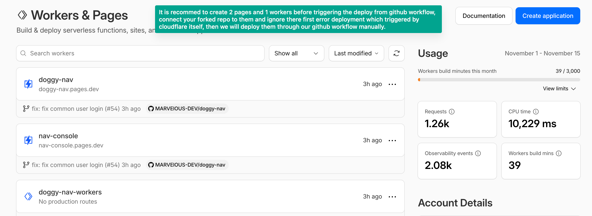
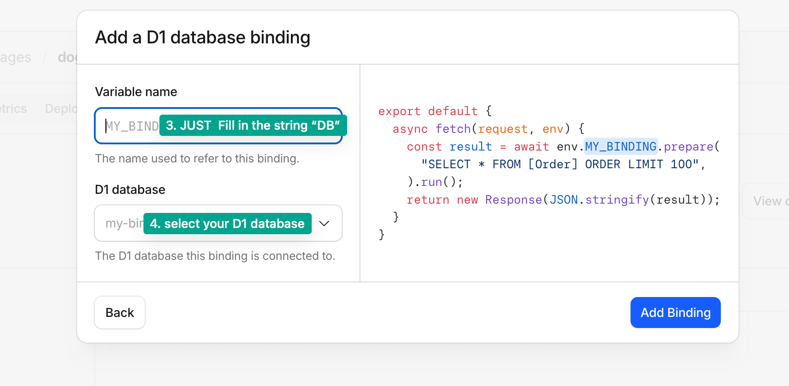
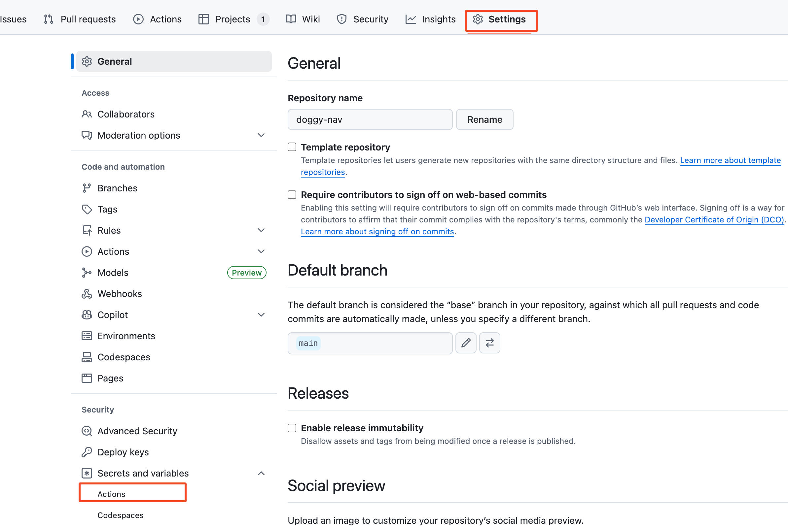
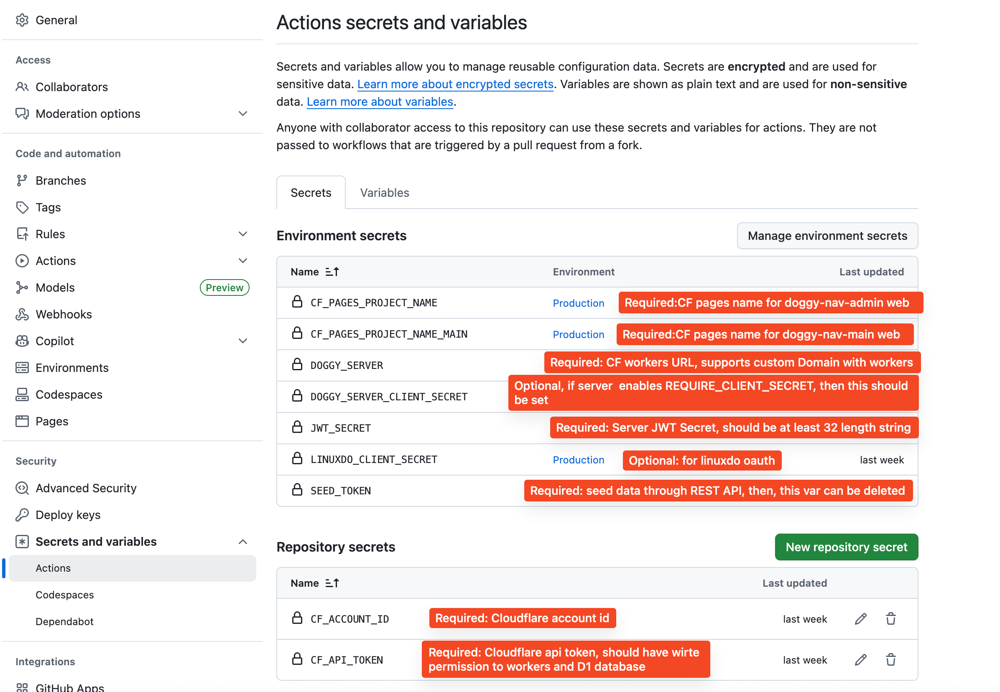
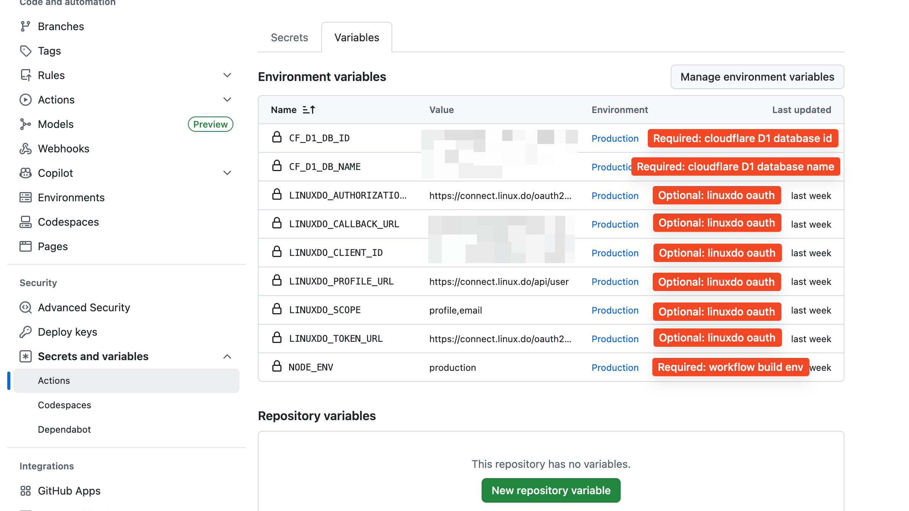
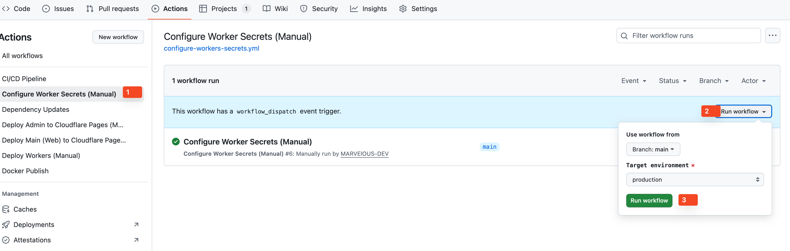
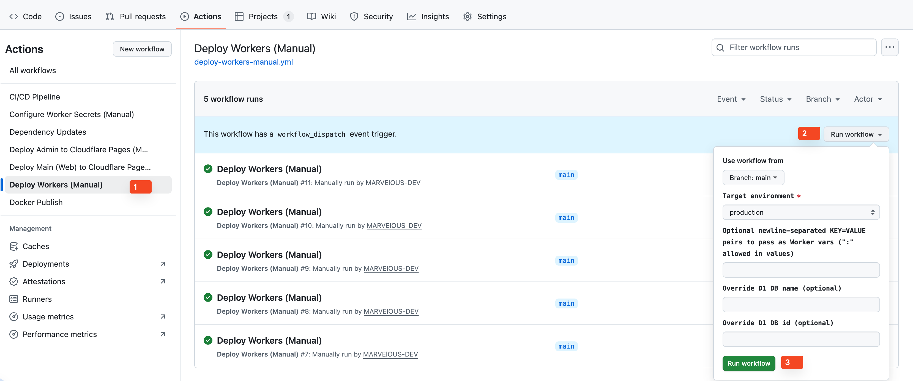
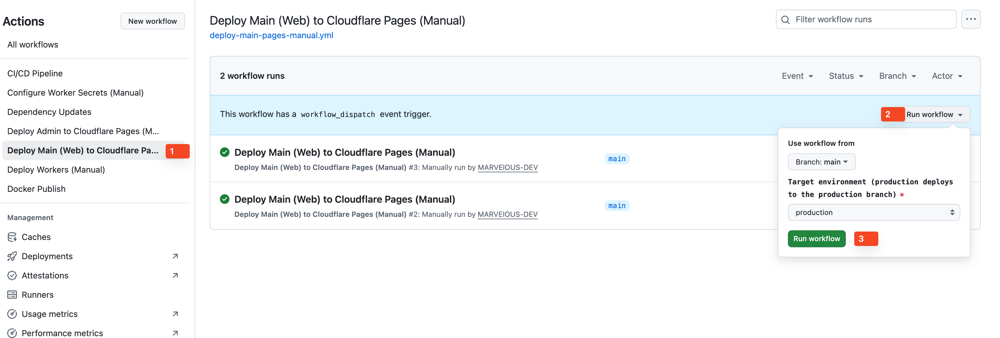
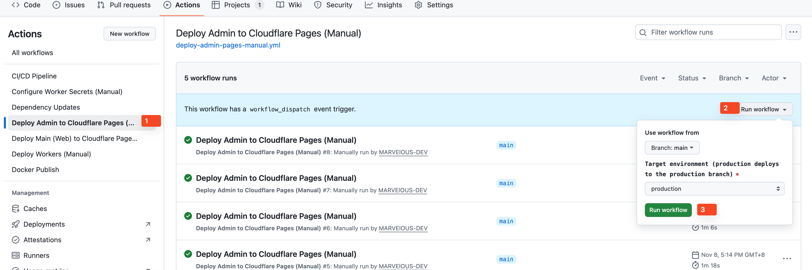

# 🐕 Doggy Nav

<div align="center">

[](https://opensource.org/licenses/MIT)
[](https://nodejs.org/)
[](http://makeapullrequest.com)


[](https://github.com/MARVElOUS-DEV/doggy-nav/actions)

_A modern, self-hosted navigation and bookmark management system_

[🚀 Features](#-features) • [📦 Quick Start](#-quick-start) • [🔧 Development](#-development) • [🐳 Docker](#-docker-deployment) • [📖 Documentation](#-documentation)

</div>

---

## 📝 Overview

Doggy Nav is a comprehensive navigation and bookmark management system designed for teams and individuals. Built with modern web technologies, it provides a clean, intuitive interface for organizing and sharing bookmarks across different environments.

### 🎯 Use Cases

- **Team Bookmark Management** - Shared bookmarks for development teams
- **Personal Navigation Hub** - Private bookmark organization
- **Cloud-Based SaaS** - Multi-tenant bookmark service
- **Enterprise Portal** - Internal company navigation system

## 📸 Screenshots

<p align="center">
  
  
  <br/>
  
  
  <br/>
  
  
  <br/>
  
  
  
</p>

## ✨ Features

### 🌟 Core Features

- **📚 Smart Organization** - Categories, tags, and search functionality
- **👥 Multi-User Support** - User authentication and permissions
- **⭐ Favorites System** - Quick access to frequently used bookmarks
- **📊 Analytics Dashboard** - View counts and popularity metrics
- **🔍 Advanced Search** - Full-text search with filters
- **📱 Responsive Design** - Works on desktop, tablet, and mobile

### 🛠 Technical Features

- **🚀 High Performance** - Built with Next.js and modern frameworks
- **🔒 Security First** - JWT authentication, input validation
- **🐳 Docker Ready** - Easy deployment with Docker containers
- **📈 Scalable Architecture** - Microservices-based design
- **🔄 Real-time Updates** - Live data synchronization
- **🌐 Internationalization** - Multi-language support (English, Chinese)

## 🏗 Architecture

Doggy Nav supports two backend stacks and multiple deployment targets (Docker, traditional Node hosting, and Cloudflare Pages/Workers):

```
┌─────────────────────────────── Frontends & Admin ───────────────────────────────┐
│                                                                               │
│  doggy-nav-main (Next.js)           doggy-nav-admin (Umi SPA)                 │
│  - Docker: http://localhost:3001    - Docker: http://localhost:8080           │
│  - Vercel / Node hosting            - Cloudflare Pages + Pages Functions      │
└───────────────────────────────┬───────────────────────────────────────────────┘
                                │
                  ┌─────────────┴───────────────────┐
                  │                                 │
        Classic backend stack               Edge backend stack
          (Docker / Node)                  (Cloudflare Workers)

   ┌─────────────────────────┐        ┌─────────────────────────┐
   │ doggy-nav-server        │        │ doggy-nav-workers       │
   │ Egg.js REST API         │        │ Hono on Cloudflare      │
   │ Port: 3002 (Docker)     │        │ Workers / D1 database   │
   └─────────────┬───────────┘        └─────────────┬───────────┘
                 │                                  │
        ┌────────▼────────┐                 ┌───────▼──────────┐
        │   MongoDB       │                 │  Cloudflare D1   │
        │   Port: 27017   │                 │  (SQL at edge)   │
        └─────────────────┘                 └───────────────────┘
```

### 📁 Project Structure

```
doggy-nav/
├── packages/
│   ├── doggy-nav-main/     # Next.js frontend application
│   ├── doggy-nav-server/   # Egg.js backend API
│   └── doggy-nav-admin/    # UmiJS admin panel
│   └── doggy-nav-core/    # shared backend pkg
│   └── doggy-nav-workers/    # cloudflare workers service
├── deploy/                 # Deployment configurations
├── scripts/                # Build and deployment scripts
└── docs/                   # Documentation
```

## 📦 Quick Start

### ⚡ Quick Start with Docker

```bash
# get the dockerfile
mkdir doggy-nav
cd doggy-nav
wget https://raw.githubusercontent.com/MARVElOUS-DEV/doggy-nav/refs/heads/main/docker-compose.yml
```

> **update the JWT_SECRET with at least 32 length complicated string for your service security, otherwise all the service will fail**

<strong>this is important!!</strong>

```bash
# start the containers
docker compose up -d

# initialize the system user
docker exec -it doggy-nav-server sh -c "node utils/postinstall.js"

# initialize the system categories and nav items
docker exec -it doggy-nav-server sh -c "node utils/initCategories.js"
```

🎉 Doggy Nav is running!

Access the applications in current machine with their exposed ports, you can add any reverse proxy for your service if you like.

Frontend: http://localhost:3001, front also supports vercel deploy
[](https://vercel.com/new/git/external?repository-url=https://github.com/MARVElOUS-DEV/doggy-nav%2Ftree%2Fmaster)

Backend API: http://localhost:3002

Admin Panel: http://localhost:8080

### ⚡ Quick Start with Cloudflare

1. Fork the repo
2. Create a D1 database from your cloudflare console. pay attention to the DB name and its id. they will be used later.
3. Link your cloudflare workers and pages with your forked repo, then go to the repo settings page to set the secrets and variables

- in the cloudflare console side:
  
  
  

- in the github side:
  
  
  

4. Trigger the github actions in your repo.
   4.1 Deploy the workers secrets first time
   
   4.2 then deploy the workers
   
   4.3 deploy main or admin web
   
   

5. initialize the system user and categories\nav items with REST Api, this rely on the seed token set in your github action secrets. so if you have initialized the system, we recommend you remove the SEED_TOKEN secret from your github action secrets.

```bash
curl -X POST "https://<your-worker>.<account>.workers.dev/api/seed/defaults?token=<SEED_TOKEN>"
curl -X POST "https://<your-worker>.<account>.workers.dev/api/seed/categories?token=<SEED_TOKEN>"
```

### 🛠 Development Setup

See `docs/DEVELOPMENT.md` for local setup, scripts, database, and environment configuration.

## 📖 Documentation

### 📚 Additional Docs

- [🧭 Repository Guidelines](AGENTS.md) - Monorepo structure, workflow, and contributor expectations
- [🐳 Docker Guide](docs/DOCKER.md) - Comprehensive Docker deployment
- [🚀 Deployment Guide](docs/DEPLOYMENT.md) - Cloud deployment instructions
- [🔄 CI/CD Guide](docs/CI-CD.md) - Continuous integration setup
- [🛠 API Documentation](docs/server/API.md) - Backend API reference

### 🏗 Development Guides

- [Frontend Development](packages/doggy-nav-main/README.md)
- [Backend Development](packages/doggy-nav-server/README.md)
- [Admin Panel Development](packages/doggy-nav-admin/README.md)
- [Workers Development](packages/doggy-nav-workers/README.md)

## 🛡 Security

### 🔒 Security Features

- **JWT Authentication** - Secure token-based auth
- **Rate Limiting** - API request throttling
- **Input Validation** - SQL injection prevention
- **CORS Protection** - Cross-origin request security
- **Environment Variables** - Secret management

### 📝 Security Policy

- Report security vulnerabilities privately via email
- Security updates are prioritized and released quickly
- We follow responsible disclosure practices

## 📊 Performance

### ⚡ Optimization Features

- **Next.js SSG/SSR** - Fast page loads
- **MongoDB Indexing** - Optimized database queries
- **Docker Multi-stage** - Minimal container sizes
- **CDN Ready** - Static asset optimization
- **Caching Strategies** - Redis support for sessions

### 📈 Monitoring

- Health check endpoints
- Performance metrics
- Error tracking and logging

## 📄 License

This project is licensed under the **MIT License** - see the [LICENSE](LICENSE) file for details.

## 🙏 Acknowledgments

### 💝 Special Thanks

- **Contributors** - All the amazing developers who helped build this
- **Open Source Community** - For the incredible tools and libraries
- **Beta Testers** - For valuable feedback and bug reports

### 🛠 Built With

- [Next.js](https://nextjs.org/) - React framework
- [Egg.js](https://eggjs.org/) - Node.js backend framework
- [UmiJS](https://umijs.org/) - React application framework
- [MongoDB](https://mongodb.com/) - NoSQL database
- [Cloudflare Workers](https://developers.cloudflare.com/workers/) - Edge runtime backend
- [Hono](https://hono.dev/) - Web framework for Workers
- [Cloudflare Pages](https://developers.cloudflare.com/pages/) - Static hosting + Pages Functions
- [Cloudflare D1](https://developers.cloudflare.com/d1/) - SQL database at the edge
- [Docker](https://docker.com/) - Containerization
- [Arco Design](https://arco.design/) - UI component library
