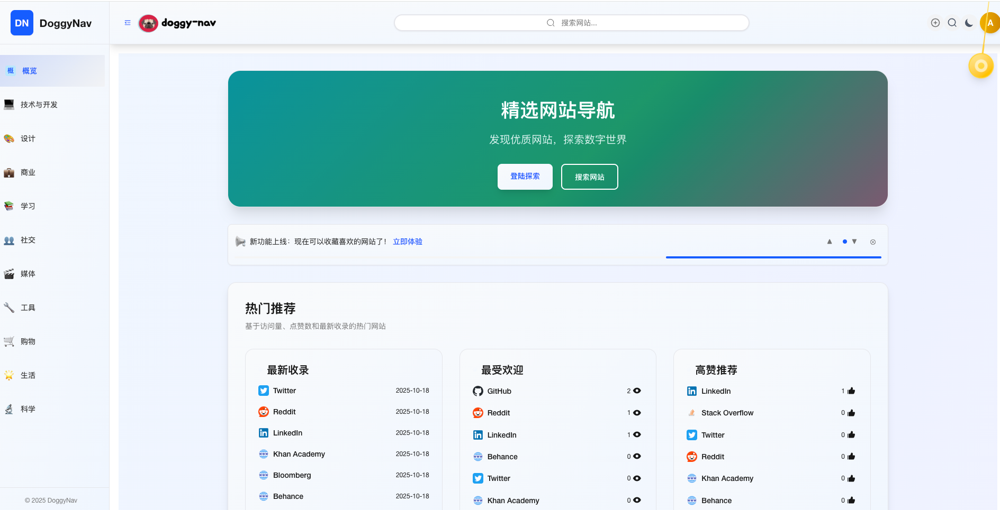
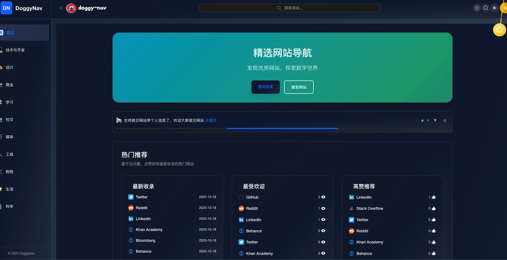
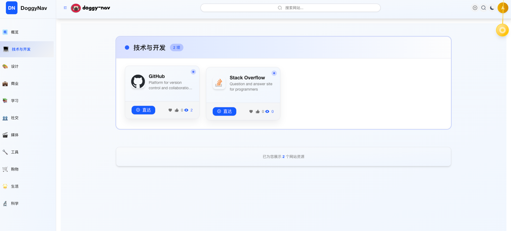
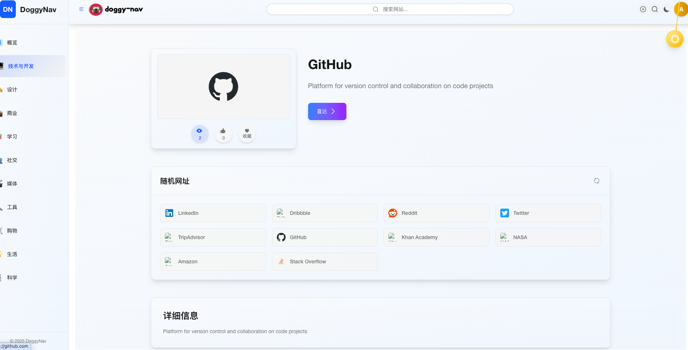
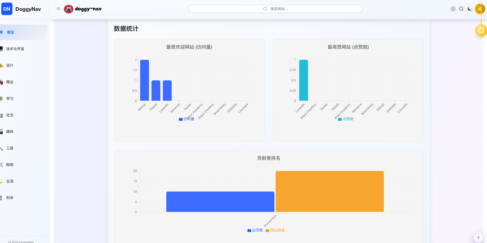
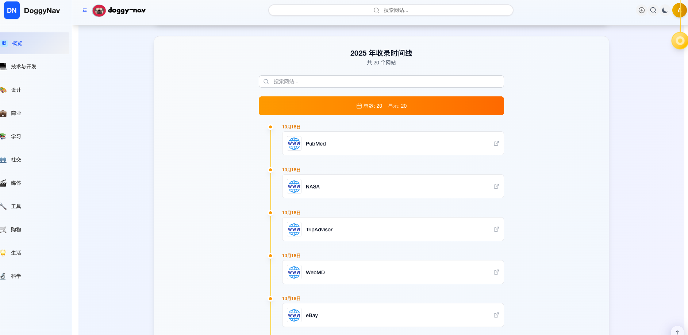
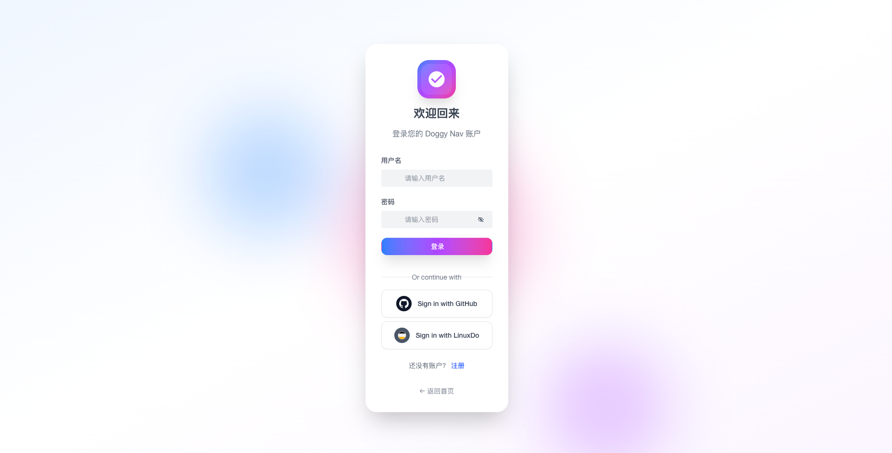
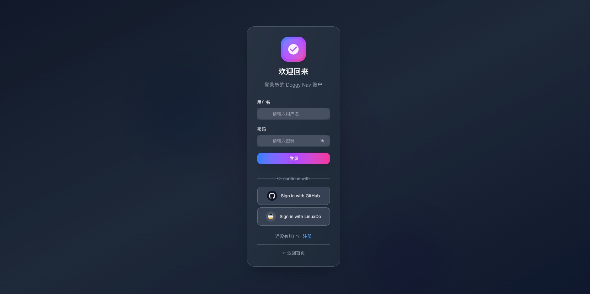

# 🐕 Doggy Nav

<div align="center">

[](https://opensource.org/licenses/MIT)
[](https://nodejs.org/)
[](http://makeapullrequest.com)
[](https://github.com/MARVElOUS-DEV/doggy-nav/actions)

_A modern, self-hosted navigation and bookmark management system_

[🚀 Features](#-features) • [📦 Quick Start](#-quick-start) • [🔧 Development](#-development) • [🐳 Docker](#-docker-deployment) • [📖 Documentation](#-documentation)

</div>

---

## 📝 Overview

Doggy Nav is a comprehensive navigation and bookmark management system designed for teams and individuals. Built with modern web technologies, it provides a clean, intuitive interface for organizing and sharing bookmarks across different environments.

### 🎯 Use Cases

- **Team Bookmark Management** - Shared bookmarks for development teams
- **Personal Navigation Hub** - Private bookmark organization
- **Cloud-Based SaaS** - Multi-tenant bookmark service
- **Enterprise Portal** - Internal company navigation system

## 📸 Screenshots

<p align="center">
  
  
  <br/>
  
  
  <br/>
  
  
  <br/>
  
  
  
</p>

## ✨ Features

### 🌟 Core Features

- **📚 Smart Organization** - Categories, tags, and search functionality
- **👥 Multi-User Support** - User authentication and permissions
- **⭐ Favorites System** - Quick access to frequently used bookmarks
- **📊 Analytics Dashboard** - View counts and popularity metrics
- **🔍 Advanced Search** - Full-text search with filters
- **📱 Responsive Design** - Works on desktop, tablet, and mobile

### 🛠 Technical Features

- **🚀 High Performance** - Built with Next.js and modern frameworks
- **🔒 Security First** - JWT authentication, input validation
- **🐳 Docker Ready** - Easy deployment with Docker containers
- **📈 Scalable Architecture** - Microservices-based design
- **🔄 Real-time Updates** - Live data synchronization
- **🌐 Internationalization** - Multi-language support (English, Chinese)

## 🏗 Architecture

Doggy Nav supports two backend stacks and multiple deployment targets (Docker, traditional Node hosting, and Cloudflare Pages/Workers):

```
┌─────────────────────────────── Frontends & Admin ───────────────────────────────┐
│                                                                               │
│  doggy-nav-main (Next.js)           doggy-nav-admin (Umi SPA)                 │
│  - Docker: http://localhost:3001    - Docker: http://localhost:8080           │
│  - Vercel / Node hosting            - Cloudflare Pages + Pages Functions      │
└───────────────────────────────┬───────────────────────────────────────────────┘
                                │
                  ┌─────────────┴───────────────────┐
                  │                                 │
        Classic backend stack               Edge backend stack
          (Docker / Node)                  (Cloudflare Workers)

   ┌─────────────────────────┐        ┌─────────────────────────┐
   │ doggy-nav-server        │        │ doggy-nav-workers       │
   │ Egg.js REST API         │        │ Hono on Cloudflare      │
   │ Port: 3002 (Docker)     │        │ Workers / D1 database   │
   └─────────────┬───────────┘        └─────────────┬───────────┘
                 │                                  │
        ┌────────▼────────┐                 ┌───────▼──────────┐
        │   MongoDB       │                 │  Cloudflare D1   │
        │   Port: 27017   │                 │  (SQL at edge)   │
        └─────────────────┘                 └───────────────────┘
```

### 📁 Project Structure

```
doggy-nav/
├── packages/
│   ├── doggy-nav-main/     # Next.js frontend application
│   ├── doggy-nav-server/   # Egg.js backend API
│   └── doggy-nav-admin/    # UmiJS admin panel
│   └── doggy-nav-core/    # shared backend pkg
│   └── doggy-nav-workers/    # cloudflare workers service
├── deploy/                 # Deployment configurations
├── scripts/                # Build and deployment scripts
└── docs/                   # Documentation
```

## 📦 Quick Start

### ⚡ Quick Start with Docker (CI images — recommended)

```bash
# Clone the repository
git clone https://github.com/MARVElOUS-DEV/doggy-nav.git
cd doggy-nav

# Use prebuilt images from CI (defaults: ghcr.io/marvelous-dev, tag=latest)
docker compose up -d

# Access the applications
echo "🎉 Doggy Nav is running!"
echo "Frontend: http://localhost:3001"
echo "Backend API: http://localhost:3002"
echo "Admin Panel: http://localhost:8080"
```

Alternative: build images locally

```bash
cp deploy/.env.example deploy/.env   # optional, edit values like JWT_SECRET/MONGO_ROOT_PASSWORD
docker compose -f deploy/docker-compose-init-prod.yml --env-file deploy/.env up -d --build
```

- For cloud/platform deployment, see docs/DEPLOYMENT.md.
- For Docker/Compose deployment, see docs/DOCKER.md.

### 🛠 Development Setup

See `docs/DEVELOPMENT.md` for local setup, scripts, database, and environment configuration.

## 📖 Documentation

### 📚 Additional Docs

- [🧭 Repository Guidelines](AGENTS.md) - Monorepo structure, workflow, and contributor expectations
- [🐳 Docker Guide](docs/DOCKER.md) - Comprehensive Docker deployment
- [🚀 Deployment Guide](docs/DEPLOYMENT.md) - Cloud deployment instructions
- [🔄 CI/CD Guide](docs/CI-CD.md) - Continuous integration setup
- [🛠 API Documentation](docs/server/API.md) - Backend API reference

### 🏗 Development Guides

- [Frontend Development](packages/doggy-nav-main/README.md)
- [Backend Development](packages/doggy-nav-server/README.md)
- [Admin Panel Development](packages/doggy-nav-admin/README.md)
- [Workers Development](packages/doggy-nav-workers/README.md)

## 🤝 Contributing

We welcome contributions! Please follow these steps:

### 🔄 Development Workflow

0. **Review the repo guide**  
   Skim through [AGENTS.md](AGENTS.md) to understand coding standards, testing expectations, and commit conventions.

1. **Fork & Clone**

   ```bash
   git clone https://github.com/YOUR_USERNAME/doggy-nav.git
   cd doggy-nav
   ```

2. **Create Feature Branch**

   ```bash
   git checkout -b feature/amazing-feature
   ```

3. **Install & Setup**

   ```bash
   pnpm install
   cp packages/doggy-nav-server/.env.example packages/doggy-nav-server/.env.local
   ```

4. **Develop & Test**

   ```bash
   pnpm server:dev  # Start backend
   pnpm web:dev     # Start frontend
   pnpm admin:dev     # Start frontend
   pnpm workers:dev     # Start frontend
   pnpm test        # Run tests
   ```

5. **Commit & Push**

   ```bash
   pnpm commit      # Use conventional commits
   git push origin feature/amazing-feature
   ```

6. **Create Pull Request**

### 📋 Contribution Guidelines

- **Code Style**: ESLint + Prettier (auto-formatted)
- **Commits**: Use [Conventional Commits](https://conventionalcommits.org/)
- **Testing**: Add tests for new features
- **Documentation**: Update docs for API changes

### 🐛 Bug Reports

Found a bug? Please create an issue with:

- **Environment details** (OS, Node.js version, etc.)
- **Steps to reproduce**
- **Expected vs actual behavior**
- **Screenshots** (if applicable)

## 🛡 Security

### 🔒 Security Features

- **JWT Authentication** - Secure token-based auth
- **Rate Limiting** - API request throttling
- **Input Validation** - SQL injection prevention
- **CORS Protection** - Cross-origin request security
- **Environment Variables** - Secret management

### 📝 Security Policy

- Report security vulnerabilities privately via email
- Security updates are prioritized and released quickly
- We follow responsible disclosure practices

## 📊 Performance

### ⚡ Optimization Features

- **Next.js SSG/SSR** - Fast page loads
- **MongoDB Indexing** - Optimized database queries
- **Docker Multi-stage** - Minimal container sizes
- **CDN Ready** - Static asset optimization
- **Caching Strategies** - Redis support for sessions

### 📈 Monitoring

- Health check endpoints
- Performance metrics
- Error tracking and logging

## 📄 License

This project is licensed under the **MIT License** - see the [LICENSE](LICENSE) file for details.

## 🙏 Acknowledgments

### 💝 Special Thanks

- **Contributors** - All the amazing developers who helped build this
- **Open Source Community** - For the incredible tools and libraries
- **Beta Testers** - For valuable feedback and bug reports

### 🛠 Built With

- [Next.js](https://nextjs.org/) - React framework
- [Egg.js](https://eggjs.org/) - Node.js backend framework
- [UmiJS](https://umijs.org/) - React application framework
- [MongoDB](https://mongodb.com/) - NoSQL database
- [Cloudflare Workers](https://developers.cloudflare.com/workers/) - Edge runtime backend
- [Hono](https://hono.dev/) - Web framework for Workers
- [Cloudflare Pages](https://developers.cloudflare.com/pages/) - Static hosting + Pages Functions
- [Cloudflare D1](https://developers.cloudflare.com/d1/) - SQL database at the edge
- [Docker](https://docker.com/) - Containerization
- [Arco Design](https://arco.design/) - UI component library
